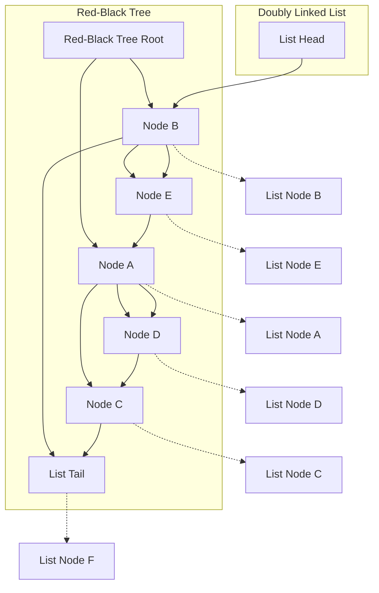

# LVGL 缓存框架实现细节

## 1. 缓存策略实现

### 1.1 LRU 缓存策略

LVGL 缓存框架实现了最近最少使用（LRU）缓存策略，这是一种广泛使用的缓存淘汰算法。当缓存达到容量上限时，LRU 策略会淘汰最长时间未被访问的条目，以为新条目腾出空间。

#### 1.1.1 数据结构

LRU 缓存实现使用了两种主要的数据结构：

1. **红黑树**：用于高效查找缓存条目，时间复杂度为 O(log n)。
2. **双向链表**：用于维护缓存条目使用的顺序，最近使用的条目在链表头部，最少使用的条目在尾部。

```c
typedef struct _lv_lru_rb_t {
    lv_cache_t cache;           /* 基础缓存结构 */
    lv_rb_t rb;                /* 红黑树 */
    lv_ll_t ll;                /* 双向链表 */
    lv_lru_rb_get_size_cb_t get_data_size_cb; /* 获取数据大小的回调函数 */
} lv_lru_rb_t;
```



#### 1.1.2 LRU 操作流程

1. **查找操作**：
   - 使用红黑树快速查找缓存条目
   - 如果找到，将条目移动到链表头部（标记为最近使用）
   - 返回找到的条目

2. **添加操作**：
   - 检查是否有足够空间
   - 如果空间不足，淘汰链表尾部的条目（最少使用）
   - 创建新条目并添加到红黑树和链表头部
   - 返回新添加的条目

3. **淘汰操作**：
   - 从链表尾部获取最少使用的条目
   - 检查条目是否可以淘汰（引用计数为零）
   - 如果可以淘汰，从红黑树和链表中移除条目
   - 标记条目为无效，但不释放内存（等待引用计数为零时释放）

### 1.2 基于计数的 LRU 缓存

基于计数的 LRU 缓存（`lv_cache_class_lru_rb_count`）限制缓存中条目的数量。当缓存中的条目数量达到最大值时，会淘汰最少使用的条目。

```c
typedef struct _lv_lru_rb_count_t {
    lv_lru_rb_t lru_rb;        /* LRU 红黑树基础结构 */
} lv_lru_rb_count_t;
```

#### 1.2.1 空间检查

```c
static lv_cache_reserve_cond_t lru_rb_count_reserve_cond_cb(lv_cache_t * cache, const void * key, uint32_t reserved_size, void * user_data)
{
    lv_lru_rb_count_t * count_cache = (lv_lru_rb_count_t *)cache;
    
    if(cache->size < cache->max_size) {
        return LV_CACHE_RESERVE_COND_OK;
    }
    
    return LV_CACHE_RESERVE_COND_NEED_VICTIM;
}
```

### 1.3 基于大小的 LRU 缓存

基于大小的 LRU 缓存（`lv_cache_class_lru_rb_size`）限制缓存占用的总内存大小。当缓存占用的内存达到最大值时，会淘汰最少使用的条目，直到有足够的空间容纳新条目。

```c
typedef struct _lv_lru_rb_size_t {
    lv_lru_rb_t lru_rb;        /* LRU 红黑树基础结构 */
    uint32_t total_size;       /* 当前缓存占用的总内存大小 */
} lv_lru_rb_size_t;
```

#### 1.3.1 空间检查

```c
static lv_cache_reserve_cond_t lru_rb_size_reserve_cond_cb(lv_cache_t * cache, const void * key, uint32_t reserved_size, void * user_data)
{
    lv_lru_rb_size_t * size_cache = (lv_lru_rb_size_t *)cache;
    uint32_t data_size = size_cache->lru_rb.get_data_size_cb(key, user_data);
    
    if(data_size > cache->max_size) {
        return LV_CACHE_RESERVE_COND_TOO_LARGE;
    }
    
    if(size_cache->total_size + data_size <= cache->max_size) {
        return LV_CACHE_RESERVE_COND_OK;
    }
    
    return LV_CACHE_RESERVE_COND_NEED_VICTIM;
}
```

## 2. 引用计数机制

### 2.1 引用计数原理

缓存条目使用引用计数机制来跟踪当前有多少客户端正在使用该条目。这种机制确保即使条目从缓存中淘汰，正在使用的资源也不会被释放，直到所有客户端都释放它们。

```c
typedef struct _lv_cache_entry_t {
    const lv_cache_t * cache;   /* 指向所属缓存实例的指针 */
    int32_t ref_cnt;           /* 引用计数 */
    uint32_t node_size;        /* 条目的大小 */
    bool is_invalid;           /* 无效标志 */
} lv_cache_entry_t;
```

### 2.2 引用计数操作

#### 2.2.1 增加引用计数

```c
int32_t lv_cache_entry_acquire(lv_cache_entry_t * entry)
{
    LV_ASSERT_NULL(entry);
    return lv_atomic_inc(&entry->ref_cnt);
}
```

#### 2.2.2 减少引用计数

```c
int32_t lv_cache_entry_release(lv_cache_entry_t * entry)
{
    LV_ASSERT_NULL(entry);
    return lv_atomic_dec(&entry->ref_cnt);
}
```

#### 2.2.3 获取引用计数

```c
int32_t lv_cache_entry_get_ref(lv_cache_entry_t * entry)
{
    LV_ASSERT_NULL(entry);
    return lv_atomic_load(&entry->ref_cnt);
}
```

### 2.3 条目生命周期管理

1. **创建条目**：初始引用计数为 1
2. **获取条目**：增加引用计数
3. **释放条目**：减少引用计数
4. **淘汰条目**：标记条目为无效，但不释放内存
5. **删除条目**：当引用计数为零且条目被标记为无效时，释放内存

```c
void lv_cache_entry_delete(lv_cache_entry_t * entry)
{
    LV_ASSERT_NULL(entry);
    LV_ASSERT(lv_cache_entry_get_ref(entry) == 0);
    lv_free(entry);
}
```

## 3. 线程安全实现

### 3.1 互斥锁机制

缓存框架通过互斥锁机制实现线程安全，确保在多线程环境中安全地访问和修改缓存数据。每个缓存实例都有一个互斥锁，在缓存操作期间获取和释放。

```c
typedef struct _lv_cache_t {
    /* ... 其他字段 ... */
    lv_mutex_t lock;           /* 互斥锁 */
    /* ... 其他字段 ... */
} lv_cache_t;
```

### 3.2 锁操作

#### 3.2.1 获取缓存条目

```c
lv_cache_entry_t * lv_cache_acquire(lv_cache_t * cache, const void * key, void * user_data)
{
    LV_ASSERT_NULL(cache);
    LV_ASSERT_NULL(key);
    
    lv_cache_entry_t * entry = NULL;
    
    lv_mutex_lock(&cache->lock);
    
    if(cache->size == 0) {
        lv_mutex_unlock(&cache->lock);
        return NULL;
    }
    
    entry = cache->clz->get_cb(cache, key, user_data);
    if(entry != NULL) {
        lv_cache_entry_acquire_data(entry);
    }
    
    lv_mutex_unlock(&cache->lock);
    
    return entry;
}
```

#### 3.2.2 添加缓存条目

```c
lv_cache_entry_t * lv_cache_add(lv_cache_t * cache, const void * key, void * user_data)
{
    LV_ASSERT_NULL(cache);
    LV_ASSERT_NULL(key);
    
    lv_cache_entry_t * entry = NULL;
    
    lv_mutex_lock(&cache->lock);
    
    if(cache->max_size == 0) {
        lv_mutex_unlock(&cache->lock);
        return NULL;
    }
    
    entry = cache_add_internal_no_lock(cache, key, user_data);
    if(entry != NULL) {
        lv_cache_entry_acquire_data(entry);
    }
    
    lv_mutex_unlock(&cache->lock);
    
    return entry;
}
```

### 3.3 原子操作

引用计数的增加和减少使用原子操作，确保在多线程环境中的安全性。

```c
int32_t lv_cache_entry_acquire(lv_cache_entry_t * entry)
{
    LV_ASSERT_NULL(entry);
    return lv_atomic_inc(&entry->ref_cnt);
}

int32_t lv_cache_entry_release(lv_cache_entry_t * entry)
{
    LV_ASSERT_NULL(entry);
    return lv_atomic_dec(&entry->ref_cnt);
}
```

## 4. 红黑树实现

### 4.1 红黑树特性

红黑树是一种自平衡的二叉搜索树，具有以下特性：

1. 每个节点要么是红色，要么是黑色
2. 根节点是黑色
3. 所有叶子节点（NIL）都是黑色
4. 如果一个节点是红色，则它的两个子节点都是黑色
5. 对于每个节点，从该节点到其所有后代叶子节点的简单路径上，均包含相同数量的黑色节点

这些特性确保了树的高度保持在 O(log n) 级别，从而提供高效的查找性能。

### 4.2 红黑树操作

#### 4.2.1 查找操作

```c
static lv_cache_entry_t * lru_rb_get_cb(lv_cache_t * cache, const void * key, void * user_data)
{
    lv_lru_rb_t * lru_rb = (lv_lru_rb_t *)cache;
    lv_rb_node_t * node = lv_rb_find(&lru_rb->rb, key);
    
    if(node == NULL) {
        return NULL;
    }
    
    lv_cache_entry_t * entry = LV_CONTAINER_OF(node, lv_cache_entry_t, node);
    
    /* 将条目移动到链表头部（标记为最近使用） */
    _lv_ll_remove(&lru_rb->ll, entry);
    _lv_ll_ins_head(&lru_rb->ll, entry);
    
    return entry;
}
```

#### 4.2.2 插入操作

```c
static lv_cache_entry_t * lru_rb_add_cb(lv_cache_t * cache, const void * key, void * user_data)
{
    lv_lru_rb_t * lru_rb = (lv_lru_rb_t *)cache;
    
    /* 分配新条目 */
    lv_cache_entry_t * entry = lv_malloc(cache->node_size);
    if(entry == NULL) {
        return NULL;
    }
    
    /* 初始化条目 */
    entry->cache = cache;
    entry->ref_cnt = 1;
    entry->node_size = cache->node_size;
    entry->is_invalid = false;
    
    /* 复制键 */
    memcpy(lv_cache_entry_get_data(entry), key, cache->ops.key_size);
    
    /* 插入红黑树 */
    lv_rb_node_t * node = (lv_rb_node_t *)entry;
    lv_rb_insert(&lru_rb->rb, node);
    
    /* 插入链表头部 */
    _lv_ll_ins_head(&lru_rb->ll, entry);
    
    /* 更新缓存大小 */
    cache->size++;
    
    return entry;
}
```

#### 4.2.3 删除操作

```c
static void lru_rb_remove_cb(lv_cache_t * cache, lv_cache_entry_t * entry, void * user_data)
{
    lv_lru_rb_t * lru_rb = (lv_lru_rb_t *)cache;
    
    /* 从红黑树中移除 */
    lv_rb_node_t * node = (lv_rb_node_t *)entry;
    lv_rb_remove(&lru_rb->rb, node);
    
    /* 从链表中移除 */
    _lv_ll_remove(&lru_rb->ll, entry);
    
    /* 更新缓存大小 */
    cache->size--;
    
    /* 标记条目为无效 */
    entry->is_invalid = true;
}
```

## 5. 内存管理

### 5.1 内存分配

缓存框架使用 LVGL 的内存分配函数 `lv_malloc` 和 `lv_free` 来管理内存。这些函数可以根据不同的平台和配置使用不同的内存分配策略。

```c
lv_cache_entry_t * entry = lv_malloc(cache->node_size);
```

### 5.2 内存布局

缓存条目的内存布局如下：

```
+------------------+
| lv_cache_entry_t | 缓存条目头部
+------------------+
| 用户数据         | 缓存的实际数据
+------------------+
```

用户数据的指针可以通过以下函数获取：

```c
void * lv_cache_entry_get_data(lv_cache_entry_t * entry)
{
    LV_ASSERT_NULL(entry);
    return (void *)(entry + 1);
}
```

### 5.3 内存释放策略

缓存框架使用引用计数机制来管理内存的释放。当一个缓存条目的引用计数降为零且被标记为无效时，才会释放其内存。

```c
void lv_cache_release(lv_cache_t * cache, lv_cache_entry_t * entry, void * user_data)
{
    LV_ASSERT_NULL(cache);
    LV_ASSERT_NULL(entry);
    
    lv_mutex_lock(&cache->lock);
    
    lv_cache_entry_release_data(entry, user_data);
    
    if(lv_cache_entry_get_ref(entry) == 0 && lv_cache_entry_is_invalid(entry)) {
        if(cache->ops.free_cb) {
            cache->ops.free_cb(lv_cache_entry_get_data(entry), user_data);
        }
        lv_cache_entry_delete(entry);
    }
    
    lv_mutex_unlock(&cache->lock);
}
```

## 6. 性能优化

### 6.1 查找优化

缓存框架使用红黑树进行高效的条目查找，时间复杂度为 O(log n)。这比线性查找（O(n)）要快得多，特别是对于大型缓存。

### 6.2 LRU 更新优化

缓存框架使用双向链表实现 LRU 策略，使 LRU 更新的时间复杂度为 O(1)。每次访问一个条目时，只需要将其从当前位置移动到链表头部，这是一个常数时间的操作。

### 6.3 内存使用优化

基于大小的 LRU 缓存可以根据实际数据大小动态调整缓存容量，避免内存浪费。缓存框架还提供了自定义的内存分配和释放回调，允许开发者实现更高效的内存管理策略。

### 6.4 锁粒度优化

缓存框架使用每个缓存实例一个互斥锁的策略，而不是全局锁，这减少了线程之间的竞争，提高了并发性能。

## 7. 调试支持

### 7.1 缓存名称

每个缓存实例都可以设置一个名称，用于调试和识别。

```c
void lv_cache_set_name(lv_cache_t * cache, const char * name)
{
    LV_ASSERT_NULL(cache);
    cache->name = name;
}
```

### 7.2 断言

缓存框架使用 LVGL 的断言机制来检查参数和状态的有效性，帮助开发者发现和修复错误。

```c
LV_ASSERT_NULL(cache);
LV_ASSERT(lv_cache_entry_get_ref(entry) == 0);
```

### 7.3 日志

缓存框架使用 LVGL 的日志机制来记录重要事件和错误，帮助开发者理解缓存的行为和诊断问题。

```c
LV_LOG_ERROR("Failed to create cache");
LV_LOG_WARN("Cache is full, evicting entries");
```

## 8. 扩展性设计

### 8.1 自定义缓存类

开发者可以通过实现 `lv_cache_class_t` 接口来创建自定义缓存策略。这需要实现一组回调函数，定义缓存的行为。

```c
const lv_cache_class_t my_custom_cache_class = {
    .alloc_cb = my_alloc_cb,
    .init_cb = my_init_cb,
    .destroy_cb = my_destroy_cb,
    .get_cb = my_get_cb,
    .add_cb = my_add_cb,
    .remove_cb = my_remove_cb,
    .drop_cb = my_drop_cb,
    .drop_all_cb = my_drop_all_cb,
    .get_victim_cb = my_get_victim_cb,
    .reserve_cond_cb = my_reserve_cond_cb,
    .iter_create_cb = my_iter_create_cb,
};
```

### 8.2 自定义操作回调

开发者可以通过提供自定义的 `lv_cache_ops_t` 回调函数来自定义缓存的行为，如比较键、创建和释放数据等。

```c
lv_cache_t * cache = lv_cache_create(&lv_cache_class_lru_rb_size, sizeof(my_data_t), 1024 * 1024, (lv_cache_ops_t) {
    .compare_cb = my_compare_cb,
    .create_cb = my_create_cb,
    .free_cb = my_free_cb,
});
```

### 8.3 自定义数据类型

缓存框架可以用于各种类型的数据，不限于图像资源。开发者只需要定义适当的数据结构和操作回调，就可以将缓存框架用于任何类型的资源。

```c
typedef struct {
    const char * key;       /* 缓存键 */
    void * data;            /* 缓存数据 */
    uint32_t size;          /* 数据大小 */
} my_custom_cache_data_t;

static int32_t my_compare_cb(const void * key1, const void * key2)
{
    const my_custom_cache_data_t * data1 = key1;
    const my_custom_cache_data_t * data2 = key2;
    return strcmp(data1->key, data2->key);
}

static void my_free_cb(void * data, void * user_data)
{
    my_custom_cache_data_t * cache_data = data;
    if(cache_data->data) {
        lv_free(cache_data->data);
    }
}
```